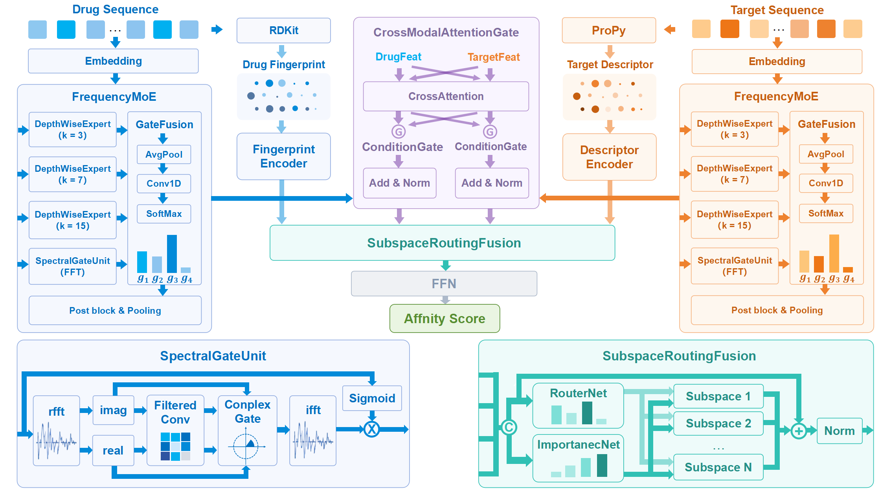

# FSR-DTA: Frequency Mixture-of-Experts and Subspace Routing for Drug-Target Affinity Prediction

[](https://www.python.org/)
[](https://pytorch.org/)
[](LICENSE)

> **FSR-DTA** is a dual-stream deep learning framework for predicting drug-target binding affinity. It integrates sequence-based features with RDKit molecular fingerprints and ProPy protein descriptors, and introduces novel components for frequency-aware encoding, cross-modal interaction, and adaptive multi-source feature fusion.

---

## 📌 Key Features

- **FrequencyMoE Module** – Multi-scale depthwise convolutions (kernel sizes 3, 7, 15) combined with an FFT-based Spectral Gate Unit to capture both local sequence motifs and global frequency-domain dependencies.
- **CrossModalAttentionGate** – Bidirectional cross-attention between drug and target representations for deep inter-modal interactions.
- **AdaptiveSubspaceRoutingFusion** – Dynamically routes multi-modal features into multiple latent subspaces for adaptive weighting and aggregation, reducing redundancy and modality imbalance.
- **Multimodal Inputs** – Supports sequences, RDKit fingerprints (3,446-dim), and ProPy descriptors (8,567-dim).
- **State-of-the-Art Performance** – Outperforms DeepDTA, GraphDTA, ML-DTI, AttentionDTA, LLMDTA, and mambatranDTA on Davis, KIBA, and Metz benchmarks.

---

## 🧠 Architecture Overview


---

## 🚀 Getting Started
The dataset is too large to be hosted on GitHub. Researchers interested in obtaining the dataset are welcome to request access via email at wzs13141@gmail.com.
```bash
# Clone the repo
git clone https://github.com/yourusername/FSRDTA.git
cd FSRDTA

# Install dependencies
pip install -r requirements.txt

# Prepare data
python get_mol_des.py
python get_pro_des.py

# Train model
python train.py 


# Evaluate
python eval.py 
